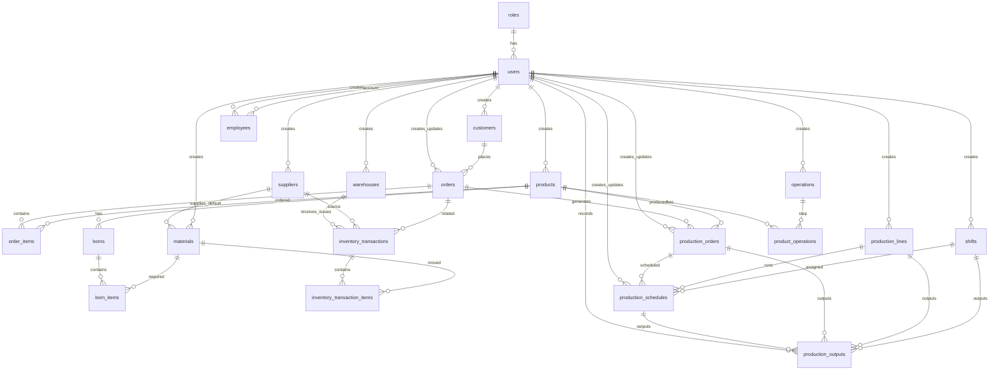

# Báo cáo cơ sở dữ liệu hệ thống quản lý sản xuất may mặc

Nguồn schema: [`apps/backend/database/migrations`](apps/backend/database/migrations).

## Tổng quan tối ưu

Schema đã tối ưu theo phương án A:

- Tổng bảng còn lại: **23 bảng**.
- Bảng nghiệp vụ: **22 bảng**.
- Bảng kỹ thuật: **1 bảng** (`schema_migrations`).
- Các bảng đã loại bỏ/gộp: `permissions`, `role_permissions`, `order_status_histories`, `inventory_balances`, `line_employee_assignments`, `production_allocations`, `schedule_employee_assignments`, `employee_outputs`, `production_progress_snapshots`.

## 1. Danh sách các bảng

### a. Bảng `schema_migrations`

Lưu lịch sử migration đã chạy, giúp hệ thống biết file SQL nào đã được áp dụng.

| Trường | Kiểu dữ liệu | Mô tả |
|---|---|---|
| id | BIGINT UNSIGNED | Khóa chính |
| filename | VARCHAR(255) | Tên file migration, duy nhất |
| executed_at | TIMESTAMP | Thời điểm chạy migration |

### b. Bảng `roles`

Lưu danh sách vai trò trong hệ thống. Sau tối ưu, hệ thống phân quyền trực tiếp theo vai trò thay vì dùng bảng quyền chi tiết.

| Trường | Kiểu dữ liệu | Mô tả |
|---|---|---|
| id | BIGINT UNSIGNED | Khóa chính |
| code | VARCHAR(50) | Mã vai trò, duy nhất |
| name | VARCHAR(100) | Tên vai trò |
| description | VARCHAR(255) | Mô tả vai trò |
| created_at | TIMESTAMP | Thời điểm tạo |
| updated_at | TIMESTAMP | Thời điểm cập nhật |

### c. Bảng `users`

Lưu tài khoản đăng nhập, thông tin xác thực, vai trò và trạng thái khóa tài khoản.

| Trường | Kiểu dữ liệu | Mô tả |
|---|---|---|
| id | BIGINT UNSIGNED | Khóa chính |
| username | VARCHAR(50) | Tên đăng nhập, duy nhất |
| email | VARCHAR(150) | Email, duy nhất |
| full_name | VARCHAR(150) | Họ tên |
| password_hash | VARCHAR(255) | Mật khẩu đã băm |
| role_id | BIGINT UNSIGNED | Khóa ngoại đến `roles.id` |
| is_locked | BOOLEAN | Trạng thái khóa tài khoản |
| last_login_at | DATETIME | Lần đăng nhập cuối |
| created_at | TIMESTAMP | Thời điểm tạo |
| updated_at | TIMESTAMP | Thời điểm cập nhật |

### d. Bảng `system_settings`

Lưu cấu hình hệ thống dạng khóa-giá trị.

| Trường | Kiểu dữ liệu | Mô tả |
|---|---|---|
| id | BIGINT UNSIGNED | Khóa chính |
| setting_key | VARCHAR(100) | Khóa cấu hình, duy nhất |
| setting_value | TEXT | Giá trị cấu hình |
| created_at | TIMESTAMP | Thời điểm tạo |
| updated_at | TIMESTAMP | Thời điểm cập nhật |

### e. Bảng `customers`

Lưu thông tin khách hàng đặt may, thông tin liên hệ, mã số thuế và trạng thái hoạt động.

| Trường | Kiểu dữ liệu | Mô tả |
|---|---|---|
| id | BIGINT UNSIGNED | Khóa chính |
| customer_code | VARCHAR(50) | Mã khách hàng, duy nhất |
| customer_name | VARCHAR(150) | Tên khách hàng |
| contact_person | VARCHAR(150) | Người liên hệ |
| phone | VARCHAR(30) | Số điện thoại |
| email | VARCHAR(150) | Email |
| address | VARCHAR(255) | Địa chỉ |
| tax_code | VARCHAR(50) | Mã số thuế |
| notes | TEXT | Ghi chú |
| is_active | BOOLEAN | Trạng thái hoạt động |
| created_by | BIGINT UNSIGNED | Người tạo, khóa ngoại đến `users.id` |
| created_at | TIMESTAMP | Thời điểm tạo |
| updated_at | TIMESTAMP | Thời điểm cập nhật |

### f. Bảng `products`

Lưu danh mục sản phẩm may mặc, gồm mã, tên, nhóm hàng, đơn vị tính, thời gian chuẩn và hình ảnh.

| Trường | Kiểu dữ liệu | Mô tả |
|---|---|---|
| id | BIGINT UNSIGNED | Khóa chính |
| product_code | VARCHAR(50) | Mã sản phẩm, duy nhất |
| product_name | VARCHAR(150) | Tên sản phẩm |
| category | VARCHAR(100) | Nhóm sản phẩm |
| unit | VARCHAR(30) | Đơn vị tính |
| description | TEXT | Mô tả |
| standard_time_minutes | INT UNSIGNED | Thời gian chuẩn theo phút |
| image_url | VARCHAR(255) | Đường dẫn hình ảnh |
| is_active | BOOLEAN | Trạng thái hoạt động |
| created_by | BIGINT UNSIGNED | Người tạo, khóa ngoại đến `users.id` |
| created_at | TIMESTAMP | Thời điểm tạo |
| updated_at | TIMESTAMP | Thời điểm cập nhật |

### g. Bảng `orders`

Lưu đơn hàng khách hàng, gồm ngày đặt, ngày giao dự kiến, ưu tiên và trạng thái hiện tại. Lịch sử trạng thái đã được giản lược.

| Trường | Kiểu dữ liệu | Mô tả |
|---|---|---|
| id | BIGINT UNSIGNED | Khóa chính |
| order_code | VARCHAR(50) | Mã đơn hàng, duy nhất |
| customer_id | BIGINT UNSIGNED | Khóa ngoại đến `customers.id` |
| order_date | DATE | Ngày đặt hàng |
| expected_delivery_date | DATE | Ngày giao dự kiến |
| priority | ENUM | LOW, NORMAL, HIGH, URGENT |
| status | ENUM | Trạng thái đơn hàng hiện tại |
| notes | TEXT | Ghi chú |
| created_by | BIGINT UNSIGNED | Người tạo, khóa ngoại đến `users.id` |
| updated_by | BIGINT UNSIGNED | Người cập nhật, khóa ngoại đến `users.id` |
| created_at | TIMESTAMP | Thời điểm tạo |
| updated_at | TIMESTAMP | Thời điểm cập nhật |

### h. Bảng `order_items`

Lưu chi tiết sản phẩm trong đơn hàng.

| Trường | Kiểu dữ liệu | Mô tả |
|---|---|---|
| id | BIGINT UNSIGNED | Khóa chính |
| order_id | BIGINT UNSIGNED | Khóa ngoại đến `orders.id` |
| product_id | BIGINT UNSIGNED | Khóa ngoại đến `products.id` |
| quantity | INT UNSIGNED | Số lượng |
| unit_price | DECIMAL(15,2) | Đơn giá |
| color | VARCHAR(80) | Màu |
| size | VARCHAR(50) | Kích cỡ |
| notes | TEXT | Ghi chú |
| created_at | TIMESTAMP | Thời điểm tạo |
| updated_at | TIMESTAMP | Thời điểm cập nhật |

### i. Bảng `suppliers`

Lưu thông tin nhà cung cấp nguyên phụ liệu.

| Trường | Kiểu dữ liệu | Mô tả |
|---|---|---|
| id | BIGINT UNSIGNED | Khóa chính |
| supplier_code | VARCHAR(50) | Mã nhà cung cấp, duy nhất |
| supplier_name | VARCHAR(150) | Tên nhà cung cấp |
| contact_person | VARCHAR(150) | Người liên hệ |
| phone | VARCHAR(30) | Số điện thoại |
| email | VARCHAR(150) | Email |
| address | VARCHAR(255) | Địa chỉ |
| tax_code | VARCHAR(50) | Mã số thuế |
| notes | TEXT | Ghi chú |
| is_active | BOOLEAN | Trạng thái hoạt động |
| created_by | BIGINT UNSIGNED | Người tạo, khóa ngoại đến `users.id` |
| created_at | TIMESTAMP | Thời điểm tạo |
| updated_at | TIMESTAMP | Thời điểm cập nhật |

### j. Bảng `materials`

Lưu danh mục nguyên phụ liệu. Tồn kho được tính từ giao dịch kho đã ghi sổ, không lưu bảng số dư riêng.

| Trường | Kiểu dữ liệu | Mô tả |
|---|---|---|
| id | BIGINT UNSIGNED | Khóa chính |
| material_code | VARCHAR(50) | Mã vật tư, duy nhất |
| material_name | VARCHAR(150) | Tên vật tư |
| category | ENUM | FABRIC, THREAD, BUTTON, ZIPPER, LABEL, PACKAGING, ACCESSORY, OTHER |
| unit | VARCHAR(30) | Đơn vị tính |
| color | VARCHAR(80) | Màu sắc |
| specification | VARCHAR(255) | Quy cách |
| minimum_stock | DECIMAL(15,4) | Tồn kho tối thiểu |
| default_supplier_id | BIGINT UNSIGNED | Khóa ngoại đến `suppliers.id` |
| notes | TEXT | Ghi chú |
| is_active | BOOLEAN | Trạng thái hoạt động |
| created_by | BIGINT UNSIGNED | Người tạo, khóa ngoại đến `users.id` |
| created_at | TIMESTAMP | Thời điểm tạo |
| updated_at | TIMESTAMP | Thời điểm cập nhật |

### k. Bảng `warehouses`

Lưu danh sách kho nguyên phụ liệu.

| Trường | Kiểu dữ liệu | Mô tả |
|---|---|---|
| id | BIGINT UNSIGNED | Khóa chính |
| warehouse_code | VARCHAR(50) | Mã kho, duy nhất |
| warehouse_name | VARCHAR(150) | Tên kho |
| location | VARCHAR(255) | Vị trí |
| description | TEXT | Mô tả |
| is_active | BOOLEAN | Trạng thái hoạt động |
| created_by | BIGINT UNSIGNED | Người tạo, khóa ngoại đến `users.id` |
| created_at | TIMESTAMP | Thời điểm tạo |
| updated_at | TIMESTAMP | Thời điểm cập nhật |

### l. Bảng `boms`

Lưu định mức nguyên phụ liệu của sản phẩm theo phiên bản.

| Trường | Kiểu dữ liệu | Mô tả |
|---|---|---|
| id | BIGINT UNSIGNED | Khóa chính |
| product_id | BIGINT UNSIGNED | Khóa ngoại đến `products.id` |
| version | VARCHAR(50) | Phiên bản BOM |
| status | ENUM | DRAFT, ACTIVE, INACTIVE |
| effective_date | DATE | Ngày hiệu lực |
| notes | TEXT | Ghi chú |
| created_by | BIGINT UNSIGNED | Người tạo, khóa ngoại đến `users.id` |
| updated_by | BIGINT UNSIGNED | Người cập nhật, khóa ngoại đến `users.id` |
| created_at | TIMESTAMP | Thời điểm tạo |
| updated_at | TIMESTAMP | Thời điểm cập nhật |

### m. Bảng `bom_items`

Lưu chi tiết vật tư trong BOM.

| Trường | Kiểu dữ liệu | Mô tả |
|---|---|---|
| id | BIGINT UNSIGNED | Khóa chính |
| bom_id | BIGINT UNSIGNED | Khóa ngoại đến `boms.id` |
| material_id | BIGINT UNSIGNED | Khóa ngoại đến `materials.id` |
| quantity_per_unit | DECIMAL(15,4) | Định mức cho một sản phẩm |
| waste_rate_percent | DECIMAL(5,2) | Tỷ lệ hao hụt |
| notes | TEXT | Ghi chú |
| created_at | TIMESTAMP | Thời điểm tạo |
| updated_at | TIMESTAMP | Thời điểm cập nhật |

### n. Bảng `inventory_transactions`

Lưu phiếu nhập, xuất và điều chỉnh kho. Đây là nguồn chính để tính tồn kho.

| Trường | Kiểu dữ liệu | Mô tả |
|---|---|---|
| id | BIGINT UNSIGNED | Khóa chính |
| transaction_code | VARCHAR(50) | Mã giao dịch, duy nhất |
| transaction_type | ENUM | RECEIPT, ISSUE, ADJUSTMENT_IN, ADJUSTMENT_OUT |
| warehouse_id | BIGINT UNSIGNED | Khóa ngoại đến `warehouses.id` |
| supplier_id | BIGINT UNSIGNED | Khóa ngoại đến `suppliers.id` |
| order_id | BIGINT UNSIGNED | Khóa ngoại đến `orders.id` |
| transaction_date | DATE | Ngày giao dịch |
| reference_number | VARCHAR(100) | Số chứng từ |
| notes | TEXT | Ghi chú |
| status | ENUM | DRAFT, POSTED |
| created_by | BIGINT UNSIGNED | Người tạo, khóa ngoại đến `users.id` |
| posted_by | BIGINT UNSIGNED | Người ghi sổ, khóa ngoại đến `users.id` |
| posted_at | TIMESTAMP | Thời điểm ghi sổ |
| created_at | TIMESTAMP | Thời điểm tạo |
| updated_at | TIMESTAMP | Thời điểm cập nhật |

### o. Bảng `inventory_transaction_items`

Lưu chi tiết vật tư trong từng giao dịch kho.

| Trường | Kiểu dữ liệu | Mô tả |
|---|---|---|
| id | BIGINT UNSIGNED | Khóa chính |
| inventory_transaction_id | BIGINT UNSIGNED | Khóa ngoại đến `inventory_transactions.id` |
| material_id | BIGINT UNSIGNED | Khóa ngoại đến `materials.id` |
| quantity | DECIMAL(15,4) | Số lượng |
| unit_cost | DECIMAL(15,2) | Đơn giá |
| notes | TEXT | Ghi chú |
| created_at | TIMESTAMP | Thời điểm tạo |
| updated_at | TIMESTAMP | Thời điểm cập nhật |

### p. Bảng `production_lines`

Lưu danh sách chuyền sản xuất.

| Trường | Kiểu dữ liệu | Mô tả |
|---|---|---|
| id | BIGINT UNSIGNED | Khóa chính |
| line_code | VARCHAR(50) | Mã chuyền, duy nhất |
| line_name | VARCHAR(150) | Tên chuyền |
| location | VARCHAR(255) | Vị trí |
| target_workers | INT | Số công nhân mục tiêu |
| maximum_workers | INT | Số công nhân tối đa |
| status | ENUM | ACTIVE, INACTIVE, MAINTENANCE |
| description | TEXT | Mô tả |
| created_by | BIGINT UNSIGNED | Người tạo, khóa ngoại đến `users.id` |
| created_at | TIMESTAMP | Thời điểm tạo |
| updated_at | TIMESTAMP | Thời điểm cập nhật |

### q. Bảng `employees`

Lưu hồ sơ nhân viên/công nhân. Phân công nhân viên theo chuyền đã giản lược khỏi schema.

| Trường | Kiểu dữ liệu | Mô tả |
|---|---|---|
| id | BIGINT UNSIGNED | Khóa chính |
| employee_code | VARCHAR(50) | Mã nhân viên, duy nhất |
| full_name | VARCHAR(150) | Họ tên |
| date_of_birth | DATE | Ngày sinh |
| gender | VARCHAR(20) | Giới tính |
| phone | VARCHAR(30) | Số điện thoại |
| email | VARCHAR(150) | Email |
| address | VARCHAR(255) | Địa chỉ |
| hire_date | DATE | Ngày vào làm |
| position | ENUM | WORKER, LINE_LEADER, TECHNICIAN, QC, OTHER |
| skill_level | ENUM | BEGINNER, INTERMEDIATE, SKILLED, EXPERT |
| status | ENUM | ACTIVE, INACTIVE, ON_LEAVE |
| user_id | BIGINT UNSIGNED | Tài khoản liên kết, khóa ngoại đến `users.id` |
| created_by | BIGINT UNSIGNED | Người tạo, khóa ngoại đến `users.id` |
| created_at | TIMESTAMP | Thời điểm tạo |
| updated_at | TIMESTAMP | Thời điểm cập nhật |

### r. Bảng `shifts`

Lưu danh sách ca làm việc.

| Trường | Kiểu dữ liệu | Mô tả |
|---|---|---|
| id | BIGINT UNSIGNED | Khóa chính |
| shift_code | VARCHAR(50) | Mã ca, duy nhất |
| shift_name | VARCHAR(100) | Tên ca |
| start_time | TIME | Giờ bắt đầu |
| end_time | TIME | Giờ kết thúc |
| break_minutes | INT | Số phút nghỉ |
| is_active | BOOLEAN | Trạng thái hoạt động |
| created_by | BIGINT UNSIGNED | Người tạo, khóa ngoại đến `users.id` |
| created_at | TIMESTAMP | Thời điểm tạo |
| updated_at | TIMESTAMP | Thời điểm cập nhật |

### s. Bảng `operations`

Lưu danh mục công đoạn sản xuất.

| Trường | Kiểu dữ liệu | Mô tả |
|---|---|---|
| id | BIGINT UNSIGNED | Khóa chính |
| operation_code | VARCHAR(50) | Mã công đoạn, duy nhất |
| operation_name | VARCHAR(150) | Tên công đoạn |
| description | TEXT | Mô tả |
| standard_time_seconds | INT UNSIGNED | Thời gian chuẩn theo giây |
| difficulty_level | VARCHAR(50) | Mức độ khó |
| is_active | BOOLEAN | Trạng thái hoạt động |
| created_by | BIGINT UNSIGNED | Người tạo, khóa ngoại đến `users.id` |
| created_at | TIMESTAMP | Thời điểm tạo |
| updated_at | TIMESTAMP | Thời điểm cập nhật |

### t. Bảng `product_operations`

Lưu quy trình công đoạn của từng sản phẩm.

| Trường | Kiểu dữ liệu | Mô tả |
|---|---|---|
| id | BIGINT UNSIGNED | Khóa chính |
| product_id | BIGINT UNSIGNED | Khóa ngoại đến `products.id` |
| operation_id | BIGINT UNSIGNED | Khóa ngoại đến `operations.id` |
| sequence_number | INT UNSIGNED | Thứ tự công đoạn |
| standard_time_seconds | INT UNSIGNED | Thời gian chuẩn |
| required_skill_level | ENUM | Tay nghề yêu cầu |
| notes | TEXT | Ghi chú |
| created_at | TIMESTAMP | Thời điểm tạo |
| updated_at | TIMESTAMP | Thời điểm cập nhật |

### u. Bảng `production_orders`

Lưu lệnh sản xuất phát sinh từ đơn hàng và sản phẩm.

| Trường | Kiểu dữ liệu | Mô tả |
|---|---|---|
| id | BIGINT UNSIGNED | Khóa chính |
| production_order_code | VARCHAR(50) | Mã lệnh sản xuất, duy nhất |
| order_id | BIGINT UNSIGNED | Khóa ngoại đến `orders.id` |
| product_id | BIGINT UNSIGNED | Khóa ngoại đến `products.id` |
| planned_quantity | INT UNSIGNED | Số lượng kế hoạch |
| completed_quantity | INT UNSIGNED | Số lượng hoàn thành |
| rejected_quantity | INT UNSIGNED | Số lượng lỗi |
| planned_start_date | DATE | Ngày bắt đầu kế hoạch |
| planned_end_date | DATE | Ngày kết thúc kế hoạch |
| actual_start_date | DATE | Ngày bắt đầu thực tế |
| actual_end_date | DATE | Ngày kết thúc thực tế |
| priority | ENUM | LOW, NORMAL, HIGH, URGENT |
| status | ENUM | Trạng thái lệnh sản xuất |
| notes | TEXT | Ghi chú |
| created_by | BIGINT UNSIGNED | Người tạo, khóa ngoại đến `users.id` |
| updated_by | BIGINT UNSIGNED | Người cập nhật, khóa ngoại đến `users.id` |
| created_at | TIMESTAMP | Thời điểm tạo |
| updated_at | TIMESTAMP | Thời điểm cập nhật |

### v. Bảng `production_schedules`

Lưu lịch sản xuất trực tiếp theo lệnh sản xuất, chuyền, ca và ngày. Bảng này đã gộp chức năng phân bổ sản xuất từ bảng `production_allocations` cũ.

| Trường | Kiểu dữ liệu | Mô tả |
|---|---|---|
| id | BIGINT UNSIGNED | Khóa chính |
| production_order_id | BIGINT UNSIGNED | Khóa ngoại đến `production_orders.id` |
| production_line_id | BIGINT UNSIGNED | Khóa ngoại đến `production_lines.id` |
| shift_id | BIGINT UNSIGNED | Khóa ngoại đến `shifts.id` |
| schedule_date | DATE | Ngày sản xuất |
| allocated_quantity | INT UNSIGNED | Số lượng phân bổ |
| target_quantity | INT UNSIGNED | Sản lượng mục tiêu |
| planned_workers | INT UNSIGNED | Số công nhân kế hoạch |
| planned_start_date | DATE | Ngày bắt đầu kế hoạch |
| planned_end_date | DATE | Ngày kết thúc kế hoạch |
| status | ENUM | DRAFT, CONFIRMED, IN_PROGRESS, COMPLETED, CANCELLED |
| notes | TEXT | Ghi chú |
| created_by | BIGINT UNSIGNED | Người tạo, khóa ngoại đến `users.id` |
| updated_by | BIGINT UNSIGNED | Người cập nhật, khóa ngoại đến `users.id` |
| created_at | TIMESTAMP | Thời điểm tạo |
| updated_at | TIMESTAMP | Thời điểm cập nhật |

### w. Bảng `production_outputs`

Lưu sản lượng thực tế theo lịch, lệnh sản xuất, chuyền và ca. Sản lượng cá nhân đã được giản lược.

| Trường | Kiểu dữ liệu | Mô tả |
|---|---|---|
| id | BIGINT UNSIGNED | Khóa chính |
| production_schedule_id | BIGINT UNSIGNED | Khóa ngoại đến `production_schedules.id` |
| production_order_id | BIGINT UNSIGNED | Khóa ngoại đến `production_orders.id` |
| production_line_id | BIGINT UNSIGNED | Khóa ngoại đến `production_lines.id` |
| shift_id | BIGINT UNSIGNED | Khóa ngoại đến `shifts.id` |
| output_date | DATE | Ngày ghi nhận sản lượng |
| good_quantity | INT UNSIGNED | Số lượng đạt |
| defect_quantity | INT UNSIGNED | Số lượng lỗi |
| rework_quantity | INT UNSIGNED | Số lượng cần sửa |
| working_minutes | INT UNSIGNED | Số phút làm việc |
| downtime_minutes | INT UNSIGNED | Số phút dừng |
| notes | TEXT | Ghi chú |
| recorded_by | BIGINT UNSIGNED | Người ghi nhận, khóa ngoại đến `users.id` |
| created_at | TIMESTAMP | Thời điểm tạo |
| updated_at | TIMESTAMP | Thời điểm cập nhật |

## 2. Mối quan hệ giữa các bảng

| Bảng nguồn | Trường | Bảng đích | Trường | Kiểu quan hệ | Ý nghĩa |
|---|---|---|---|---|---|
| users | role_id | roles | id | N-1 | Người dùng thuộc vai trò |
| customers | created_by | users | id | N-1 | Người tạo khách hàng |
| products | created_by | users | id | N-1 | Người tạo sản phẩm |
| orders | customer_id | customers | id | N-1 | Đơn hàng thuộc khách hàng |
| orders | created_by | users | id | N-1 | Người tạo đơn hàng |
| orders | updated_by | users | id | N-1 | Người cập nhật đơn hàng |
| order_items | order_id | orders | id | N-1 | Chi tiết thuộc đơn hàng |
| order_items | product_id | products | id | N-1 | Sản phẩm trong đơn hàng |
| suppliers | created_by | users | id | N-1 | Người tạo nhà cung cấp |
| materials | default_supplier_id | suppliers | id | N-1 | Nhà cung cấp mặc định |
| materials | created_by | users | id | N-1 | Người tạo vật tư |
| warehouses | created_by | users | id | N-1 | Người tạo kho |
| boms | product_id | products | id | N-1 | BOM thuộc sản phẩm |
| boms | created_by | users | id | N-1 | Người tạo BOM |
| boms | updated_by | users | id | N-1 | Người cập nhật BOM |
| bom_items | bom_id | boms | id | N-1 | Chi tiết thuộc BOM |
| bom_items | material_id | materials | id | N-1 | Vật tư trong BOM |
| inventory_transactions | warehouse_id | warehouses | id | N-1 | Giao dịch tại kho |
| inventory_transactions | supplier_id | suppliers | id | N-1 | Nhà cung cấp liên quan |
| inventory_transactions | order_id | orders | id | N-1 | Đơn hàng liên quan |
| inventory_transactions | created_by | users | id | N-1 | Người tạo phiếu kho |
| inventory_transactions | posted_by | users | id | N-1 | Người ghi sổ |
| inventory_transaction_items | inventory_transaction_id | inventory_transactions | id | N-1 | Chi tiết thuộc phiếu kho |
| inventory_transaction_items | material_id | materials | id | N-1 | Vật tư giao dịch |
| production_lines | created_by | users | id | N-1 | Người tạo chuyền |
| employees | user_id | users | id | N-1 | Nhân viên liên kết tài khoản |
| employees | created_by | users | id | N-1 | Người tạo nhân viên |
| shifts | created_by | users | id | N-1 | Người tạo ca |
| operations | created_by | users | id | N-1 | Người tạo công đoạn |
| product_operations | product_id | products | id | N-1 | Quy trình thuộc sản phẩm |
| product_operations | operation_id | operations | id | N-1 | Công đoạn trong quy trình |
| production_orders | order_id | orders | id | N-1 | Lệnh sản xuất thuộc đơn hàng |
| production_orders | product_id | products | id | N-1 | Sản phẩm cần sản xuất |
| production_orders | created_by | users | id | N-1 | Người tạo lệnh |
| production_orders | updated_by | users | id | N-1 | Người cập nhật lệnh |
| production_schedules | production_order_id | production_orders | id | N-1 | Lịch thuộc lệnh sản xuất |
| production_schedules | production_line_id | production_lines | id | N-1 | Lịch theo chuyền |
| production_schedules | shift_id | shifts | id | N-1 | Lịch theo ca |
| production_schedules | created_by | users | id | N-1 | Người tạo lịch |
| production_schedules | updated_by | users | id | N-1 | Người cập nhật lịch |
| production_outputs | production_schedule_id | production_schedules | id | N-1 | Sản lượng theo lịch |
| production_outputs | production_order_id | production_orders | id | N-1 | Sản lượng theo lệnh |
| production_outputs | production_line_id | production_lines | id | N-1 | Sản lượng theo chuyền |
| production_outputs | shift_id | shifts | id | N-1 | Sản lượng theo ca |
| production_outputs | recorded_by | users | id | N-1 | Người ghi nhận |

## 3. Sơ đồ

